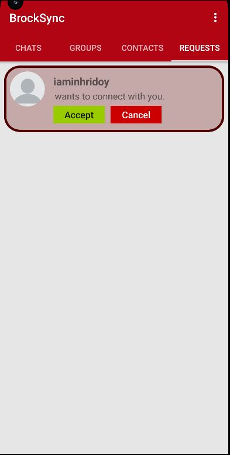

# BUSync

## Running BUSync using your own firebase production server
To run this application, you'll first need to create a Firebase account with the project name as `BUSync`.

You can do this on the firebase console using this link: 
`https://firebase.google.com/docs`

#### 1) Authentication
- Go to the authentication side menu
- Go to sign-in method and add configuration for `Email/Password` and `Google Oauth` credentials and any other sign-in provider you'd like to add to the project.

#### 2) Realtime Database
- Follow firebase instructions for creating a realtime database

#### 3) Storage
- Follow firebase instructions for creating a storage

#### 4) Functions
- Follow firebase instructions for creating a function

#### 5) After configuring your project
After creating your project, go to your project settings and add your SHA certificate fingerprint for both `SHA-1` and `SHA-256` certificates.

e.g using admin cmd to get the SHA if you already created it locally:
`keytool -list -v -keystore C:\Users\<Your name>\.android\debug.keystore -alias androiddebugkey -storepass android`

#### 6) Download the `google-services.json` file and place it inside the root of the app folder at this directory: `andriod/app/google-services.json`

## Runnig BUSync with firebase emulator for development
To use the emulator, ensure the project is on debug mode and You have Node.js installed on your system.

Use the following command for firebase CLI integration:

1) `npm install -g firebase-tools`
2) `firebase init` to initialize firebase your project locally
3) `firebase init emulators` to set up your emulators
4) `firebase emulators:start` to start the emulators

Feel free to add more initialization such as `firebase init storage` etc.

Authors:
- Kelvin Odinamadu
- Hridoy Rahman
- Ethan Brennan

References:
- https://firebase.google.com/docs
